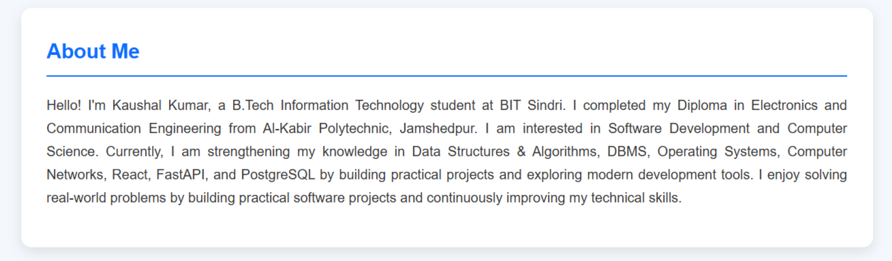
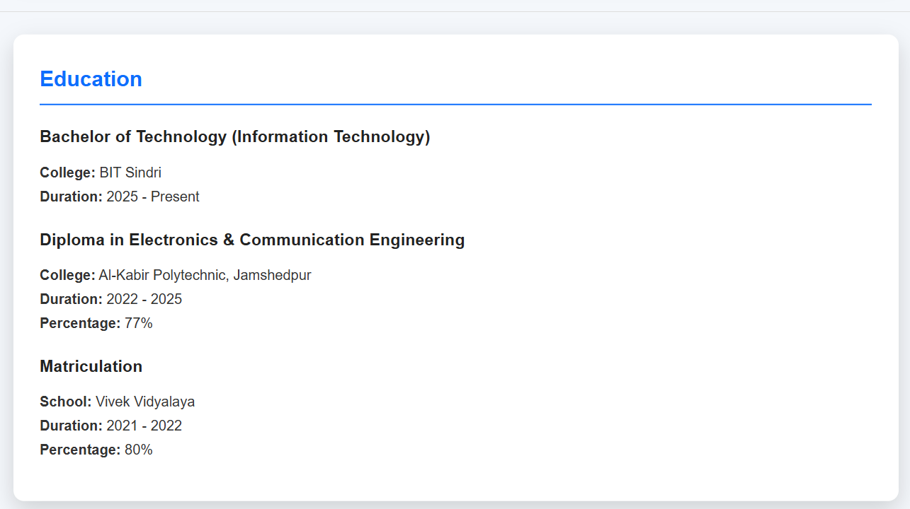
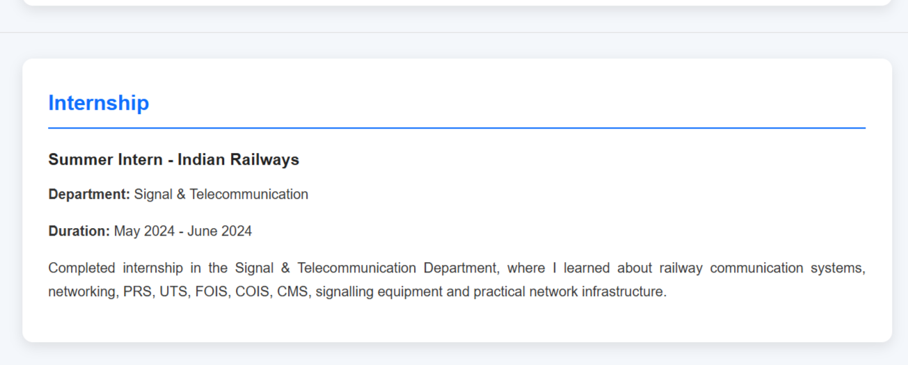
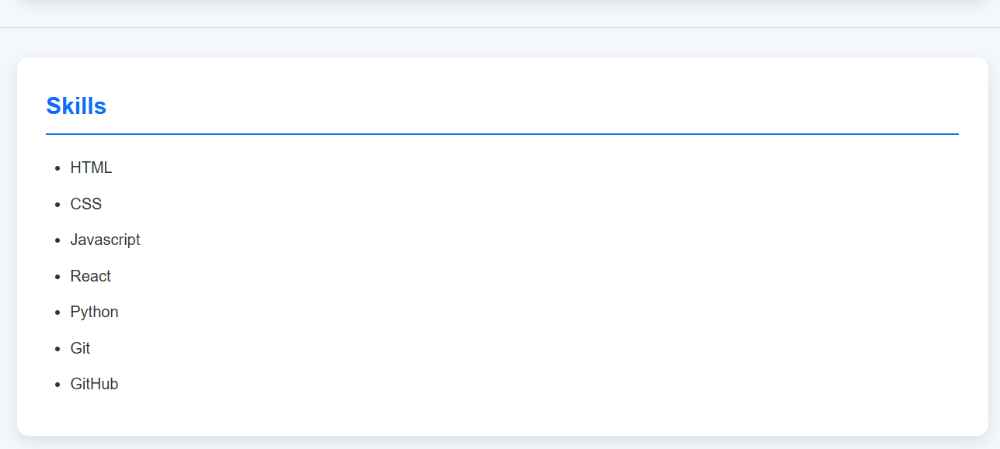
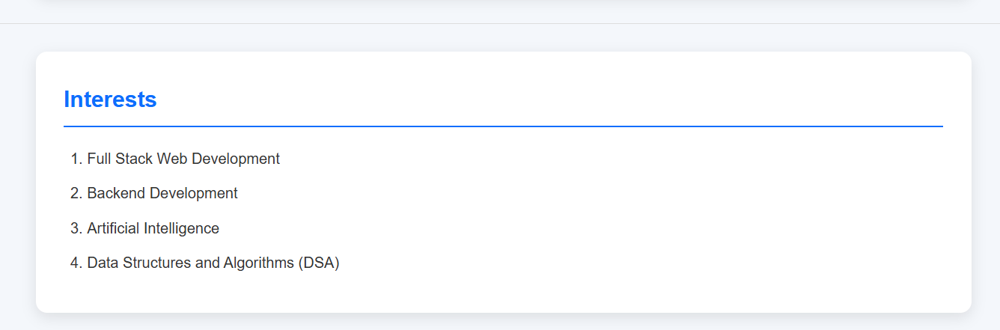
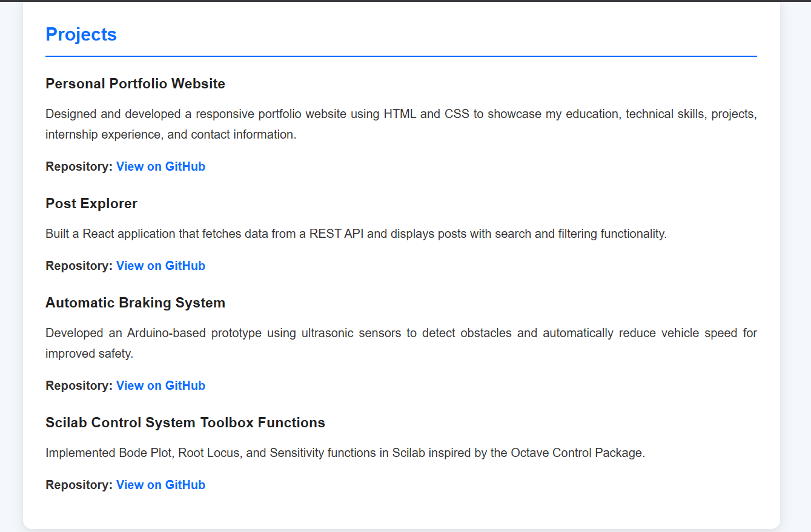
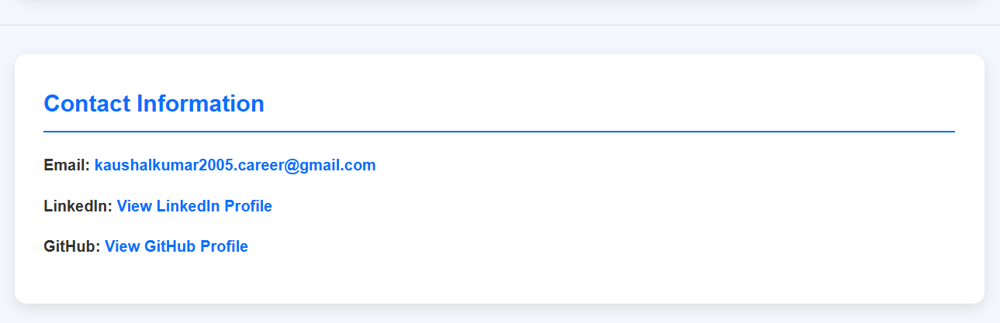

# 👨‍💻 Kaushal Kumar - Portfolio

A responsive personal portfolio website built using HTML5 and CSS3 to showcase my education, internship experience, technical skills, projects, and contact information.

---
## 📸 Screenshots

### 🏠 Home


### 👤 About


### 🎓 Education


### 💼 Internship


### 🛠 Skills


### 🎯 Interests


### 📂 Projects


### 📞 Contact


---

## 🚀 Technologies Used

- HTML5
- CSS3

---

## ✨ Features

- Responsive design
- About Me section
- Education details
- Internship experience
- Skills section
- Projects showcase
- Contact information
- Clean and modern layout

---

## 📂 Project Structure

```text
Portfolio/
│── index.html
│── style.css
└── README.md
```

---

## 💻 Featured Projects

- Personal Portfolio Website
- Post Explorer
- Automatic Braking System
- Scilab Control System Toolbox Functions

---

## ▶️ How to Run

1. Clone the repository.

```bash
git clone https://github.com/kaushalvivek2005/portfolio.git
```

2. Open the project folder.

3. Double-click `index.html` or open it using Live Server in VS Code.

---

## 📫 Contact

**Email**

kaushalkumar2005.career@gmail.com

**GitHub**

https://github.com/kaushalvivek2005

**LinkedIn**

https://www.linkedin.com/in/kaushal-kumar-bb9506328/

---

## 📄 License

This project is created for educational and portfolio purposes.
